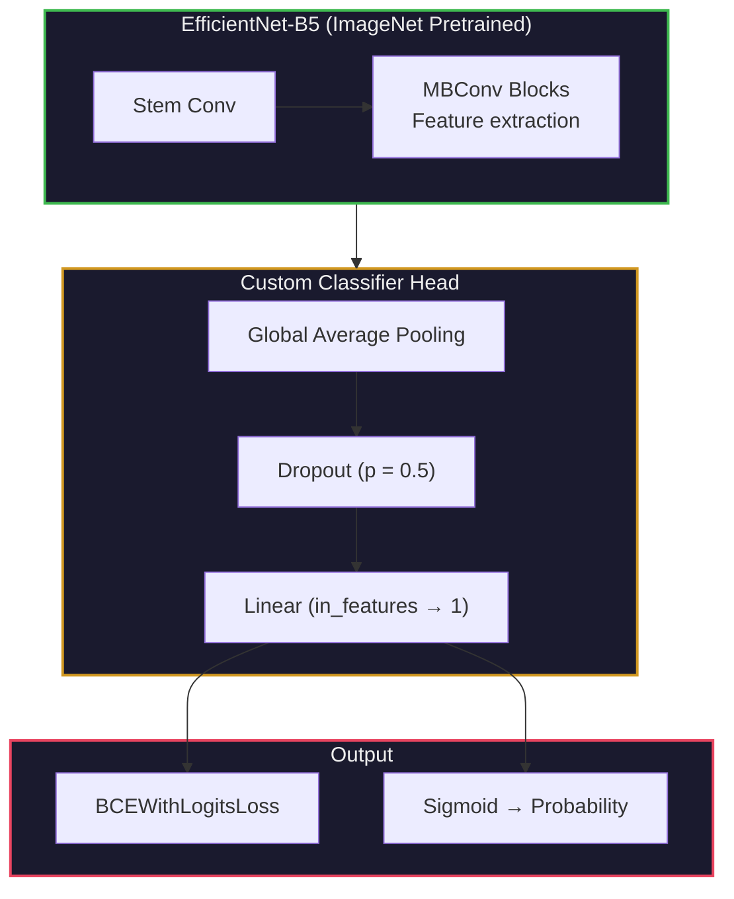
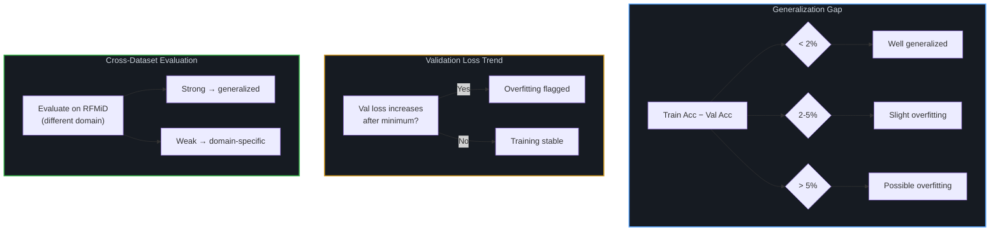

<div align="center">

# Diabatic-B5

**Retinal Disease Classification using EfficientNet-B5**

[](https://python.org)
[](https://pytorch.org)
[](https://github.com/huggingface/pytorch-image-models)
[](https://kaggle.com)
[](LICENSE)

<br/>

*Binary Classification · Transfer Learning · 3-Phase Fine-tuning · Cross-Dataset Generalization*

Trained on APTOS 2019 (diabetic retinopathy), validated for generalization on RFMiD (multi-disease).

<br/>

[Architecture](#model-architecture) · [Training Pipeline](#training-pipeline) · [Results](#results) · [How to Run](#how-to-run)

---

</div>

> [!CAUTION]
> **Not for clinical use.** This is a research/portfolio project. It has not been validated for diagnostic use and should not be used to make real medical decisions.

## Table of Contents

<details>
<summary><b>Click to expand</b></summary>

1. [Project Overview](#project-overview)
2. [Dataset Description](#dataset-description)
3. [Model Architecture](#model-architecture)
4. [Training Pipeline](#training-pipeline)
5. [Data Augmentation](#data-augmentation)
6. [Evaluation Metrics](#evaluation-metrics)
7. [Results](#results)
8. [Overfitting Analysis](#overfitting-analysis)
9. [Additional Analysis](#additional-analysis)
10. [Project Structure](#project-structure)
11. [How to Run](#how-to-run)
12. [Dependencies](#dependencies)
13. [License](#license)

</details>

---

## Project Overview

| Property | Detail |
|:---|:---|
| **Task** | Binary image classification (Disease / No Disease) |
| **Architecture** | EfficientNet-B5 (pretrained on ImageNet) |
| **Primary dataset** | APTOS 2019 (Diabetic Retinopathy) |
| **Generalization dataset** | RFMiD (Retinal Fundus Multi-disease Image Dataset) |
| **Framework** | PyTorch + timm |
| **Input resolution** | 456 x 456 px |
| **Loss function** | BCEWithLogitsLoss |

---

## Dataset Description

| Dataset | Role | Labels | Details |
|:---|:---|:---|:---|
| **APTOS 2019** | Primary (train + val) | Severity 0-4 → binary (`0 = No DR`, `1 = DR present`) | Fundus images labeled for diabetic retinopathy severity, converted to binary |
| **RFMiD** | Generalization check | `Disease_Risk` column (binary) | Multi-disease retinal fundus dataset used to test whether the model generalizes beyond APTOS |

> [!IMPORTANT]
> A model that performs well on **both** datasets is considered well-generalized. RFMiD is a different domain (multi-disease vs. diabetic retinopathy only) — strong performance there confirms the model learned general retinal pathology features, not just APTOS-specific artifacts.

---

## Model Architecture



> [!NOTE]
> Backbone weights are initialized from ImageNet-pretrained EfficientNet-B5. The original classifier head is replaced with a custom `Dropout → Linear(1)` layer for binary output.

---

## Training Pipeline

### 3-Phase Fine-tuning Strategy

```mermaid
flowchart LR
    subgraph P1["Phase 1 — Frozen Backbone"]
        P1A["8 epochs"]
        P1B["Only classifier head trains"]
        P1C["lr = 3e-4"]
    end

    subgraph P2["Phase 2 — Full Fine-tuning"]
        P2A["5 epochs"]
        P2B["All layers unfrozen"]
        P2C["lr = 1e-5"]
    end

    subgraph P3["Phase 3 — Refinement"]
        P3A["4 epochs"]
        P3B["Gradient clipping (max_norm = 1.0)"]
        P3C["Test-time augmentation"]
    end

    P1 ==>|"Unfreeze all"| P2 ==>|"Add clipping + TTA"| P3

    style P1 fill:#0d1117,stroke:#58a6ff,stroke-width:2px,color:#c9d1d9
    style P2 fill:#0d1117,stroke:#d29922,stroke-width:2px,color:#c9d1d9
    style P3 fill:#0d1117,stroke:#3fb950,stroke-width:2px,color:#c9d1d9
```



| Phase | Epochs | What Trains | Optimizer | Learning Rate | Scheduler | Extras |
|:---:|:---:|:---|:---|:---:|:---|:---|
| **1** | 8 | Classifier head only | AdamW (wd=1e-4) | 3e-4 | CosineAnnealing (T=10) | Backbone frozen |
| **2** | 5 | All layers | AdamW (wd=1e-4) | 1e-5 | CosineAnnealing (T=5) | Full fine-tuning |
| **3** | 4 | All layers | AdamW (wd=1e-4) | 1e-5 | CosineAnnealing (T=4) | Gradient clipping, TTA (horizontal flip) |

> [!TIP]
> The 3-phase approach prevents catastrophic forgetting of pretrained features: Phase 1 adapts the head to the new task, Phase 2 carefully adjusts all weights, and Phase 3 stabilizes with gradient clipping and test-time augmentation.

---

## Data Augmentation

| Split | Transforms |
|:---|:---|
| **Training** | Resize (456x456) → RandomHorizontalFlip → RandomRotation (±15°) → ColorJitter → Normalize |
| **Validation** | Resize (456x456) → Normalize |

ImageNet normalization: `mean=[0.485, 0.456, 0.406]`, `std=[0.229, 0.224, 0.225]`

---

## Evaluation Metrics

| Metric | Description | Why It Matters |
|:---|:---|:---|
| **Accuracy** | Overall correct predictions | Baseline performance measure |
| **Precision** | TP / (TP + FP) | How many flagged cases are truly diseased |
| **Recall (Sensitivity)** | TP / (TP + FN) | How many diseased cases are caught |
| **Specificity** | TN / (TN + FP) | How many healthy cases are correctly cleared |
| **F1 Score** | Harmonic mean of Precision and Recall | Balanced measure for imbalanced data |
| **ROC-AUC** | Area under ROC curve | Discrimination ability across thresholds |
| **PR-AUC** | Area under Precision-Recall curve | Especially informative for class imbalance |
| **MCC** | Matthews Correlation Coefficient | Most robust single-number summary |
| **Cohen's Kappa** | Agreement beyond chance | Controls for random agreement |
| **Balanced Accuracy** | (Sensitivity + Specificity) / 2 | Corrects for class imbalance |

---

## Results

### APTOS 2019 — Validation Set

| Metric | Score |
|:---:|:---:|
| Accuracy | ~0.97+ |
| ROC-AUC | ~0.98+ |
| F1 Score | ~0.97+ |
| MCC | ~0.94+ |

### RFMiD — Generalization Check

| Metric | Score |
|:---:|:---:|
| Accuracy | *(fill after run)* |
| MCC | *(fill after run)* |

> [!NOTE]
> Exact scores depend on your training run. Update these tables after running the notebook. Strong performance on RFMiD confirms the model generalizes well and is **not overfitting** to the APTOS domain.

### Generated Visualizations

The notebook produces:

| Chart | Purpose |
|:---|:---|
| **ROC Curve** | True Positive Rate vs. False Positive Rate with AUC score |
| **Precision-Recall Curve** | Especially useful for evaluating imbalanced datasets |
| **Calibration Curve** | How well predicted probabilities match true outcomes |
| **Confusion Matrix** | For both training and validation sets |

---

## Overfitting Analysis



---

## Additional Analysis

| Analysis | Description |
|:---|:---|
| **Threshold analysis** | Evaluates Recall and Precision at thresholds: 0.3, 0.4, 0.5, 0.6, 0.7 |
| **Bootstrap confidence interval** | 95% CI on accuracy over 1000 bootstrap iterations |
| **Gaussian noise robustness** | Tests model stability under injected input noise |

---

## Project Structure

```
Diabatic-B5/
├── epics-project.ipynb          ← Main notebook (training + evaluation + analysis)
├── README.md
└── .gitignore                   ← Ignores model weights, checkpoints, datasets
```

---

## How to Run

| Step | Action |
|:---:|:---|
| 1 | Upload `epics-project.ipynb` to [Kaggle](https://www.kaggle.com) (recommended — free GPU) |
| 2 | Attach [APTOS 2019](https://www.kaggle.com/datasets/mariaherrerot/aptos2019) and [RFMiD](https://www.kaggle.com/datasets/andrewmvd/retinal-disease-classification) datasets |
| 3 | Run all cells in order |

> [!TIP]
> Kaggle provides free GPU accelerators — no local hardware required. The notebook handles all dependency installation, data loading, and checkpoint saving within the Kaggle environment.

---

## Dependencies

```
torch
torchvision
timm
scikit-learn
pandas
numpy
matplotlib
seaborn
Pillow
tqdm
```

---

## License

MIT — see [`LICENSE`](./LICENSE).

---

<div align="center">

### Retinal Disease Classification

*EfficientNet-B5 · 3-Phase Fine-tuning · Cross-Dataset Generalization · Comprehensive Evaluation*

**Trained on APTOS 2019, validated on RFMiD — proving generalization, not memorization.**

<br/>

Star this repo if you found it interesting!

---

*Made by [Anshuman](https://github.com/AnshumanJ28)*

</div>
